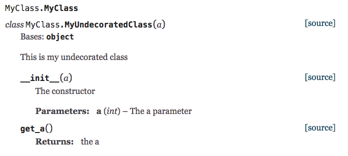

# ray_decorator_issue
Ray Decorator Issue reproducible example


## Steps to reproduce

Inside a `virtualenv` or similar:

```
git clone git@github.com:martisak/ray_decorator_issue.git 
pip install -r requirements.txt
make html
```

Then open `build/html/index.html` in your favorite browser.


### Example

 